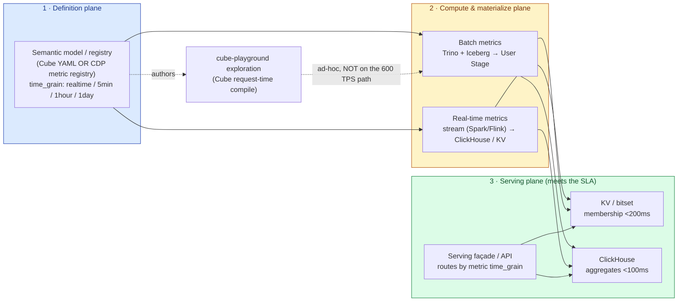

# Cube-Playground — Production Complexity & the Cube-API Scalability Risk

**Date:** 2026-05-27
**Author:** Claude analysis for khoitn@vng.com.vn
**Audience:** Business leadership (effort sizing) + technical reviewers (ThangLV / CDP, Apollo).
**Companion to:** `architecture-260526-1656-cube-apollo-june30-demo.md`, `strategy-260526-1737-cube-playground-segment-of-record-platform.md`.
**Evidence base:** codebase census (`Explore-260527-0612-complexity-census.md`), CDP Architecture & Technical Design (Confluence GDS), ThangLV's *Revamping the Segmentation Engine* proposal, `MM-01-CRUD.openapi.yaml` (the CDP metrics-registry contract), GDS 2026 KPIs.

---

## TL;DR

Cube-playground today is a **rich exploration & authoring tool** (~179k app LOC across 4 services + an external Cube semantic layer) that is **demo-grade, not production-grade**. The gap to production is not features — it's the *operational substrate*: single-process SQLite, in-memory state that breaks under more than one instance, pretend-auth (`X-Owner` header), a mocked CDP activation path, and no hardening (timeouts/retries/load tests) on the Cube calls.

**ThangLV's concern is correct and load-bearing.** The Cube API (YAML + query → raw SQL at request time, executed on Trino) is the right tool for *ad-hoc exploration* but the wrong tool for *production metric/segment serving* at CDP's SLAs (P99 ≤ 500ms, 600 TPS). It will not hold for: (a) high-TPS point/membership lookups, (b) arbitrary segment predicates that miss pre-aggregations and fall through to raw Trino (seconds–minutes), (c) the 20 array/tuple metric types CDP already serves that Cube's scalar measure/dimension model cannot express cleanly.

**The resolution is not to fight CDP — it's to draw the line.** Cube-playground should own *definition + exploration*; CDP (ThangLV's registry + orchestrator + Trino/Iceberg + ClickHouse serving) should own *materialization + serving*. The `MM-01` metrics API is literally the handoff boundary. Real-time metrics are combined and served not inside Cube's request-time compiler but by a **time-grain-routed serving tier** — exactly the `realtime / 5min / 1hour / 1day` model ThangLV already designed.

---

## 1. Scope: What "Production" Means Here

We anchor "production" to the bar CDP already commits to (GDS 2026 KPIs, ThangLV):

- **P99 serving latency ≤ 500ms**, **throughput ≥ 600 req/s**, **uptime ≥ 98%**.
- **5-game pilot → 80-game scale-out.**
- **Multi-tenant isolation** (per-game), **real identity/authz**, **PII boundary** (raw PII only in the Diamond layer / vault, never in app tier).

cube-playground was built to a different bar: a single-tenant-ish internal dev tool. Most of the complexity-to-production is closing that substrate gap, *not* the Cube question — but the Cube question is the one that decides the whole serving architecture, so it gets its own section (§5).

---

## 2. Complexity by Key Service

| Service | LOC (files) | Surface | Cluster-ready? | Hardest production gap |
|---|---|---|---|---|
| **Frontend SPA** (`src/`) | ~115k (989) | 12 page routes; calls Cube `/meta /load /sql` directly | ✅ stateless | Auth (JWT in localStorage); 5s hardcoded Cube timeout, no backoff |
| **server/** (Fastify + better-sqlite3) | ~26k (296) | 20 route modules; 16 migrations; ~12 tables | ⛔ **single-process SQLite + in-mem caches** | Not horizontally scalable as built |
| **chat-service/** (Node + Anthropic SDK) | ~37.6k (280) | 13 route modules; 17 tools; SQLite-backed | ⛔ **in-memory rate-limiter + stream registry + snapshot store** | Per-instance state; Anthropic cost/latency under load |
| **Cube semantic layer** (external :4000) | n/a (not vendored) | YAML → SQL → Trino; pre-aggs; per-game JWT | ✅ external, but ⚠️ see §5 | Request-time compile + Trino latency vs SLA |
| **Cache layers** | mixed | 3 in-memory + 3 DB-backed | 🟡 hybrid | In-memory caches desync across instances |

**Reading of the table:** the frontend is the easy part (stateless, replaceable). The two Node services carry the production risk because they hold **in-process state** that silently assumes a single instance:

- `better-sqlite3` is single-process by design (`server/src/db/sqlite.ts`) — you cannot run two server instances against the same file safely. This is the #1 structural blocker: every persisted thing (segments, dashboards, presets, anomalies, glossary, response cache) lives here.
- In-memory state that breaks at 2+ instances: app-settings cache (30s TTL Map), anomaly-detector per-game mutex (a *local* Map — two instances tick the same game concurrently), business-metrics loader cache, meta-version cache, segment-UID `Set`, and the chat-service rate-limiter buckets (instance A allows 60/min, instance B another 60/min).
- Auth is `X-Owner` / `X-Owner-Id` header trust + JWT-in-localStorage. No verification, no real identity, no per-game RBAC. CDP expects `CDP_GAME_<id>_OPERATOR`-style roles + JWT termination.

**None of this is a criticism of the build** — it's the correct shape for a fast-moving internal tool. It *is* the work that "production" means.

---

## 3. Complexity by Key Business Job

Each job is scored on **maturity now** and the **dominant work to productionize**.

| Business job | Where it lives | Maturity | Dominant production work |
|---|---|---|---|
| **1. Data exploration / playground** (NL-free query builder, SQL/JSON/chart tabs) | FE + Cube `/load /sql` | **High** — works, deep-linkable | Cube call hardening (timeout/retry/rate-limit); load behavior at concurrency |
| **2. Data-model authoring** (New Metric wizard → measure/dim/segment YAML) | FE `QueryBuilderV2/` | **Medium-high** — multi-source, N-slot, cross-cube ratio | YAML *write* path to a real model store; today client-only aliases, no server persistence of model edits |
| **3. Segmentation** (predicate tree → Cube filters → UID list, live/frozen, refresh) | server `segments` + jobs | **Medium** — single-game, cron refresh, identity_map | Materialized serving (not Cube at request time); multi-game; canonical identity; full UID export (§5, §6) |
| **4. Chat NL → query / disambiguation** (agent SDK, 3-layer memory, streaming) | chat-service | **Medium** — impressive but in-mem state, mock-free but cost-exposed | Clusterable streaming + rate-limit; Anthropic spend governance; eval harness |
| **5. LiveOps dashboards / KPI hero / anomaly inbox** | FE + server `liveops_cache` | **Medium** — DB-cached tiles, 45s refresh | Cache coordination across instances; anomaly mutex is per-instance (false "single-owner" guarantee) |
| **6. Metrics Catalog** (business-metric registry, CDP projection/verify) | FE + server `business-metrics` | **Medium** — registry + gating | This is the natural bridge to MM-01; needs to *become* a registry client, not a local file cache |
| **7. CDP activation** ("Activate to CDP") | FE + server `cdp-metrics` | **Low — mocked** | `VITE_CDP_ACTIVATION_ENABLED=false`; server route is a TODO stub. Real MM-01 integration is unbuilt |

**The pattern:** jobs 1–2 (explore, author) are where cube-playground is genuinely strong and production is mostly hardening. Jobs 3–7 (serve, activate, operate) are where the architecture has to *defer to or integrate with* CDP — and that's exactly the seam ThangLV is worried about.

---

## 4. Cross-Cutting Production Blockers (the bill, regardless of Cube)

| # | Blocker | Evidence | Size |
|---|---|---|---|
| B1 | **SQLite single-process** → no horizontal scale | `server/src/db/sqlite.ts`; migrations run per boot | L — migrate to Postgres (or hand state to CDP stores) |
| B2 | **In-memory state** (caches, mutex, rate-limit, stream registry) desyncs at 2+ instances | `app-settings-store.ts:26`, `anomaly-detector.ts:205`, chat `rate-limit.ts`, `stream-registry.ts` | M — externalize to Redis / DB / sticky-session |
| B3 | **Pretend-auth** (`X-Owner` header) | `routes-crud.test.ts:88`; no JWT verify | M — real SSO/JWT + per-game RBAC |
| B4 | **CDP activation mocked** | `cdp-metrics-client.ts` mock flag; server route TODO | M — wire MM-01 (see §6) |
| B5 | **No Cube-call hardening** (timeout/retry/rate-limit/circuit-breaker) | FE 5s timeout only; "no explicit retry/timeout toward Cube" | M — and it interacts with §5 |
| B6 | **No E2E / load suite** | 940 unit/integration test files, ~0 full-stack E2E, no load test | M — needed before any SLA claim |
| B7 | **PII boundary undefined in app tier** | identity_map holds cube dims, not canonical/PII; CDP forbids PII outside Diamond | M — must never store phone/email; resolve at activation only |

These are independent of the Cube decision. Rough order-of-magnitude: **B1+B2 are the spine** (re-platform state), everything else slots around them.

---

## 5. The Cube-API Risk (the part ThangLV is right about)

### 5.1 What the Cube API actually does

Cube is a **semantic layer**: you declare cubes/views/measures/dimensions/joins in YAML; at **request time** Cube compiles an incoming query into SQL and executes it against the datasource (here, Trino over the lakehouse). It can serve from **pre-aggregations** (materialized rollups in Cube Store) when a query matches a rollup; otherwise it falls through to the raw datasource.

That request-time compile-and-execute model is *excellent* for exploration (arbitrary slice/dice, fast iteration, one model many questions). It is the engine behind jobs 1–2, and it's why the playground feels good.

### 5.2 Why it does not hold as a production *serving* layer

| Failure mode | Mechanism | Consequence at CDP SLA (P99 ≤ 500ms, 600 TPS) |
|---|---|---|
| **Request-time Trino latency** | Non-pre-aggregated queries hit Trino directly; Trino is seconds-to-minutes by design (CDP doc: "seconds to minutes depending on partition scan") | Blows the 500ms budget by 1–3 orders of magnitude |
| **Pre-agg coverage gaps** | Pre-aggs only accelerate *known* query shapes. Segment predicates are arbitrary AND/OR trees over many dims | Cohort/segment queries routinely miss the rollup → fall through to raw Trino |
| **Point / membership lookups** | "Is user X in segment Y?" is a key lookup, not an aggregation. Cube is an aggregation query planner, not a KV/bitset store | Wrong tool entirely; 600 TPS membership belongs in ClickHouse/KV (CDP's Gofiber+Mongo serves this <200ms P99) |
| **More data types** | CDP already serves **20 array/tuple metrics** (`purchased_items_last_30d Array(String)`, `current_levels_by_server Array(Tuple(String,UInt32))`). Cube measures are numeric aggregations; dims are scalar | Cube can't model these without dropping to raw SQL dims — losing the semantic-layer benefit it was chosen for. This is exactly ThangLV's "more data types won't scale" point |
| **Operational surface** | Cube Store (pre-agg engine) + refresh scheduler is itself a stateful system to run, scale, and keep fresh | Another HA/ops burden, and refresh is *batch* — not real-time |
| **Per-request tenancy churn** | Per-game security context + JWT mint per request; noisy-neighbor on shared Trino resource groups | Isolation + token churn at 600 TPS is non-trivial |

**Bottom line:** Cube is a *query-compilation + exploration* layer. CDP needs a *materialized serving* layer. These are different jobs. Asking Cube to serve segments/metrics at 600 TPS is asking a query planner to be a serving store — it isn't one. ThangLV's instinct ("out of the box won't scale for serving segment + more data types") is the correct read.

### 5.3 How to extend to real-time metrics — combine & serve

The honest design separates **three planes** and refuses to make Cube the request-time unifier:

**The combine-and-serve rules:**

1. **A metric declares its `time_grain`** (ThangLV's model already does this). The *serving façade* — not Cube — routes a read to the right tier: realtime/5min → streaming-fed ClickHouse/KV; 1hour/1day → batch-materialized store. One contract, multiple freshness tiers behind it.
2. **Cube stays on the exploration path only.** It serves analysts asking arbitrary questions (seconds latency is fine there). It is *never* on the 600-TPS production serving path. If you want the semantic layer's convenience at low latency, point Cube at **ClickHouse** (a supported Cube driver, already materialized from Gold every 15 min) for the pre-aggregated subset — but that's an optimization, not the serving architecture.
3. **Real-time = a separate streaming write path** (Spark Structured Streaming / Flink) landing in the same serving stores the batch path writes to. You do **not** retrofit streaming into Cube's request-time compiler. ThangLV's proposal is explicit that sub-second stays on the dedicated Live-Segment surface; Trino-micro-batch caps "realtime" at 2–5 min. Match that.
4. **Membership/point lookups never touch Cube or Trino at request time.** Materialize segment membership to a KV/bitset (or ClickHouse) and serve from there — this is what `POST /check-membership` (our universal contract) should hit.

### 5.4 The uncomfortable conclusion

If the goal is **production serving of metrics + segments at CDP SLA**, cube-playground should **not build its own serving layer on Cube**. It should:
- Keep Cube for **exploration + definition authoring** (its genuine strength).
- **Emit metric/segment definitions into CDP's registry** (`MM-01`), and let CDP's orchestrator + Trino/Iceberg + ClickHouse/KV materialize and serve them.

This is not a retreat — it's the division that makes both tools play to strength and avoids cube-playground reimplementing the lakehouse serving tier ThangLV's team already runs.

### 5.5 Load test — measured 2026-05-27 (the SLA gap is real, not just argued)

We ran a concurrent load test against the **live dev Cube** (`localhost:4000`) to replace the "argued from architecture" caveat with measurement.

**Setup & honest caveats (read these before quoting the numbers):**
- **Single-node DEV Cube, tiny dev dataset, no production tuning.** This is a *floor*, not production hardware. Production Cube would be multi-node + tuned — **but production data is orders of magnitude larger, which makes the non-pre-agg / fall-through path slower, not faster.** So the *shape* of the result generalizes even though absolute ms don't.
- Tool: a 30-line Node concurrent-`fetch` harness (`/tmp/cube-load.mjs`). macOS `ab` was unusable (`apr_pollset_poll` bug). Non-200 counted as error.
- `/load` accepted queries **without a token** on this dev instance (auth disabled in dev).
- Three query profiles: **Q1** KPI time-series (`active_daily.dau` by day, 1 month — pre-agg friendly); **Q2** multi-measure + filter (`recharge.*` 4 months, miss-prone); **Q3** segment-style (`mf_users` user-level + LTV filter, high-cardinality).

**Results:**

| Profile | Concurrency | Outcome | Latency |
|---|---|---|---|
| Q1 KPI — **pre-agg / cache WARM** | 1 | 200 | **~22 ms** (cold first hit 108 ms) |
| Q1 KPI — **same query, cache COLD** | 1 | 200 | **~4,600–5,000 ms** |
| Q2 multi-measure + filter | 1 | 200 | **~4,644 ms** |
| Q3 segment-style + filter | 1 | 200 | **~4,256 ms** |
| Q1 KPI cold | 20 | latency exploded; node became **unresponsive** (empty replies) | p50 ~380 ms, **p90 ~87,000 ms**, max ~87 s |
| Q1 KPI warm-ish | 50 | tail collapse + mass connection errors | **p95 ~44,800 ms** |

**Three findings, in order of importance:**

1. **The identical KPI query swings ~200x (22 ms → ~4,600 ms) based purely on pre-agg/cache warmth.** You cannot underwrite a 500 ms P99 SLA with a layer whose *same-query* latency varies 200x on cache state. This is the core SLA risk, and it's measured, not theorized.
2. **Ad-hoc and segment-style queries (Q2/Q3) are ~4.3–4.6 s at concurrency = 1 on a tiny dataset.** These miss pre-aggs by construction (arbitrary measures + filters / high-cardinality user grouping) and fall through to the underlying engine. On production-scale data this gets worse. Segment predicates — the whole point of "serving segments" — live on this slow path.
3. **The single dev Cube node saturated and fell over twice** — at c=20 on cold queries (p90 ≈ 87 s, then empty replies) and at c=50 (p95 ≈ 44 s). It recovered each time, but "tips over well below anything resembling 600 TPS" is now an observation, not a worry. Production would add nodes — but heavy-query concurrency is exactly where a request-time compile-and-scan layer is weakest.

**Net:** the warm pre-agg path is genuinely fast (single-digit ms) — which is why exploration *feels* great and why Cube is the right *exploration* tool. But the production serving bar (P99 ≤ 500 ms across *arbitrary* metric/segment reads at 600 TPS) lands squarely on the cold / fall-through / high-concurrency path, where measured latency is **4–5 s at c=1 and tens of seconds under load.** ThangLV's concern is confirmed by measurement.

---

## 6. Where Cube-Playground Fits vs. ThangLV's CDP

ThangLV's *Revamping the Segmentation Engine* already defines the target: a **registry-driven** engine where "a segment is a boolean expression over registered metrics" and "adding a metric is a row-write, not a DDL migration." The `MM-01-CRUD.openapi.yaml` is that registry's API: `POST /cdp/v1/metrics { game_id, metric_name, source, expression, dimensions, materialize, schedule, filter }`.

**That schema is almost exactly what cube-playground's New-Metric wizard and Catalog already produce.** Note the alignment:

| cube-playground produces | MM-01 registry field |
|---|---|
| measure SQL expression (`generate-measure-yaml.ts`) | `expression` (e.g. `MAX(login_datetime)`) |
| source cube → lakehouse table | `source` (`game_integration.bi_ptg.etl_ingame_login`) |
| dimensions / group-bys | `dimensions` |
| segment predicate → SQL filter (`predicateToSql`) | `filter` |
| refresh cadence | `materialize` + `schedule` (cron) |
| game scoping | `game_id` |

**So the integration is not a rebuild — it's a serialization.** cube-playground's authoring output maps onto MM-01 with modest translation work. The "Activate to CDP" feature (currently mocked, B4) is precisely this bridge half-built. The strategic move: finish it against the *real* MM-01 registry, and let CDP own materialization + serving.

**The risk if we DON'T draw this line:** cube-playground drifts into building a parallel serving layer on Cube + Trino, hits exactly the §5.2 wall, and duplicates the lakehouse serving tier — at which point ThangLV's concern becomes a production incident instead of a design conversation.

---

## 7. Effort Framing for Business (T-shirt, not commitments)

| Workstream | Size | Why |
|---|---|---|
| **Re-platform state** (SQLite → Postgres; externalize in-memory caches/locks; clusterable streaming) — B1, B2 | **L** | Touches every persisted feature; the spine of "production" |
| **Real auth + per-game RBAC + PII boundary** — B3, B7 | **M** | SSO/JWT termination; never store PII in app tier |
| **Cube-call hardening** (timeout/retry/circuit-breaker/rate-limit) — B5 | **S–M** | Localized but required before any SLA claim |
| **Finish CDP activation against MM-01** — B4, §6 | **M** | Serialization of existing authoring output; depends on CDP registry availability |
| **Serving architecture decision** (do NOT serve from Cube; route via CDP serving tier) — §5 | **M (design) + L (if we build serving)** | Cheapest path = defer serving to CDP; expensive path = build our own (not recommended) |
| **E2E + load test harness** — B6 | **M** | Required to validate P99/TPS before go-live |
| **Real-time metric path** (streaming → serving store, time-grain routing) — §5.3 | **L** | Mostly CDP's to build; cube-playground consumes/declares, doesn't compute |

**Headline for leadership:** the feature surface is largely there; **production cost is dominated by re-platforming state (L) and the serving-architecture decision (defer-to-CDP = M, build-our-own = L+).** The single most expensive mistake would be to treat Cube as the production serving engine — that converts a Medium integration into a Large rebuild that competes with CDP.

---

## 8. Recommendations

1. **Adopt the three-plane split (§5.3).** Cube = exploration + authoring. CDP = materialize + serve. Serving façade routes by `time_grain`. Socialize this with ThangLV — it *agrees* with his revamp, it doesn't fight it.
2. **Make Catalog/New-Metric a real MM-01 client** (finish B4). Treat cube-playground's authoring output as registry input. This is the concrete deliverable that proves the division.
3. **Do not put Cube on the 600-TPS path.** Membership + hot metric reads serve from ClickHouse/KV. Cube stays for analyst-latency exploration.
4. **Sequence production work B1→B2 first** (state re-platform) — nothing else scales until this lands.
5. **Co-author the serving contract with ThangLV** so "real-time metric" has one definition (`time_grain`) and one serving façade across cube-playground, Apollo, and CDP.

---

## 9. Open Questions

1. Is the production target for cube-playground itself to *serve* at CDP SLA, or only to *author* and hand off to CDP? (This single answer flips the serving workstream between M and L+.)
2. MM-01 is v1 CRUD on definitions — does CDP's registry already trigger materialization on `materialize=true + schedule`, or is that orchestrator piece still pending (ThangLV's Phase 1a)?
3. Does cube-playground's New-Metric `expression`/`source` vocabulary line up 1:1 with what MM-01 validates against `behavior_events` / Gold tables, or is there a translation gap?
4. For the 20 array/tuple metrics — is the intent that cube-playground can *author* them at all, or do those stay CDP-native and cube-playground only references them?
5. Can cube-playground point its Cube instance at CDP's ClickHouse (Gold mirror) for low-latency exploration, or is Cube-on-Trino the only sanctioned path today?
6. ~~What is the actual measured Cube `/load` P50/P99 under concurrency?~~ **Answered — see §5.5.** Measured on dev: identical KPI query 22 ms warm vs ~4,600 ms cold (200x swing); ad-hoc/segment queries ~4.3–4.6 s at c=1; single node fell over at c=20–50 (p90 up to ~87 s). Open follow-up: re-run on a **production-sized dataset + multi-node Cube** to quantify the absolute gap (the dev box only proves the shape).
7. Who owns the serving façade (§5.3) — CDP, cube-playground, or a shared Growth-platform service?
8. Token TTL + refresh ownership for Cube — server-mint per game today; does this survive multi-instance + 600 TPS, or move behind the façade?
