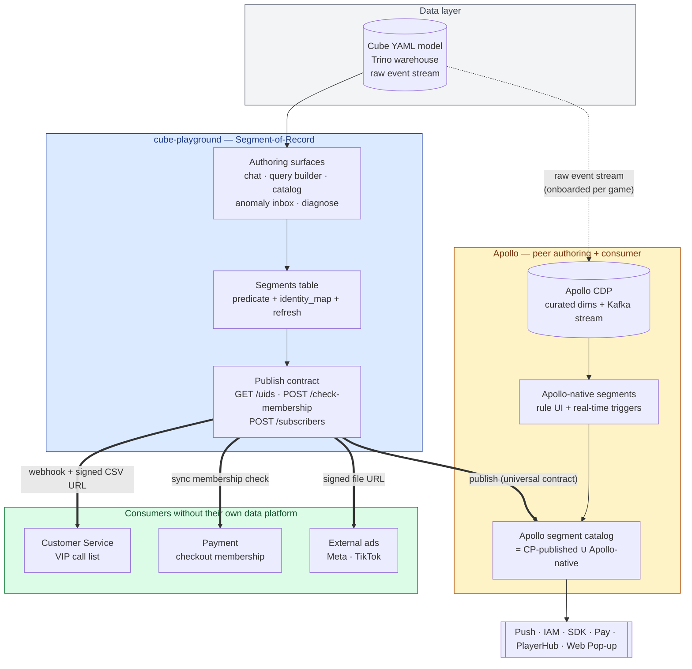

# Cube-Playground as the Segment-of-Record Platform

**Date:** 2026-05-26 (diagram + dual-authoring caveats added 17:46)
**Author:** Claude analysis for khoitn@vng.com.vn
**Audience:** VNGGames Growth leadership (Hawkins et al.) + Apollo / Payment / Customer Service cross-team pre-read.
**Companion to:** `plans/reports/architecture-260526-1656-cube-apollo-june30-demo.md` (the demo-scoped flow). This report is the value/positioning paper that sits *above* the demo.

---

## TL;DR

Cube-playground's job-to-be-done is **turning a business hypothesis into an actionable user cohort** — and keeping that cohort fresh, identity-resolved, and consumable by *any* downstream system. That's a different product from Apollo. Apollo is a **campaign-execution platform** whose rule builder is constrained to the predicate vocabulary its CDP backend models (Billing.Amount, Channel, Paying-time, Transaction — per Apollo's current UI). CP's predicate vocabulary is everything modeled in Cube YAML, which is a strict superset and grows whenever a new metric/dimension is added.

So:

- **CP is the segment-of-record.** It authors, refreshes, identity-resolves, and publishes.
- **Apollo is a peer authoring surface AND a consumer.** Apollo can keep authoring segments natively where its own capability is the right tool (real-time event triggers, Kafka stream rules). It also *consumes* CP-published segments where Cube's predicate vocabulary outreaches what CDP can model.
- **Customer Service is a second consumer** (VIP outreach lists). Today: zero infra; analyst exports CSVs manually.
- **Payment is a third consumer** (promo eligibility, refund-risk gating). Today: hardcoded SQL views per use case.
- **External ad platforms** (Meta / TikTok) are a fourth consumer. Today: Apollo's "Past Segment" export pattern, but only for segments expressible in Apollo's rule builder.

One publish contract, four consumption shapes (batch pull / membership check / webhook push), N consumers. The contract is **~80% built already** in CP — what's missing is making it real (replace mocks), adding membership check + webhook fan-out, and getting one consumer beyond Apollo to validate the shape.

---

## 1. The Picture — One Hub, Dual Authoring Path, N Consumers



**Read the picture in three layers:**

1. **CP is the segment-of-record for products without a data platform.** Customer Service, Payment, ad-platform uploaders have no warehouse-grade query engine of their own. The publish contract gives them one. They get Cube's predicate vocabulary without owning Cube.
2. **Apollo is a peer authoring surface, not an exclusive consumer.** Apollo's CDP + Kafka stream-trigger engine is genuinely capable for predicate shapes CP cannot match today (sub-30-second real-time event evaluation). Apollo *should* keep authoring natively where that's the right tool. The Apollo segment catalog is a *union* — CP-published segments coexist with Apollo-native ones.
3. **One contract, both directions.** The publish primitives (`/uids`, `/check-membership`, `/subscribers`) are the same regardless of which authoring side produces the segment or which consumer reads it. Apollo *subscribes* to CP to fill predicate gaps CDP can't model; the rest stays native. If Apollo later wants to *publish* a real-time-trigger segment to CS or Payment, the same contract carries it.

### Bottleneck tradeoffs (made explicit so we don't sleepwalk into them)

| Bottleneck shape | Where it bites | Already-in-the-model mitigation |
|---|---|---|
| **CP availability dependency** | If CP is down, sync `/check-membership` fails; webhook fan-out backs up | Sync consumers (Payment) cache last-good membership set with a fail-open/fail-closed policy chosen per use case; batch consumers tolerate hours of staleness; Apollo continues serving from its native segments |
| **Cube YAML modeling rate-limit** | A predicate needing a not-yet-modeled dimension (e.g. *"completed tutorial week 1"*) waits on a YAML PR | Still cheaper than a CDP ETL ticket, but a real queue. Apollo's native authoring bypasses CP entirely for any dim CDP already has |
| **Identity-translation single point** | If the `vga_id ↔ phone_hash` resolver flakes, CS segments stall | Resolver is one-way, lives outside CP, owned by a Pay/CRM-side identity service. Treat as an external operational dependency |
| **Refresh-cadence ceiling** | CP's cron drives ~minutes refresh; Live Segments need ~30s | CP doesn't try to compete on this surface — Apollo's stream engine keeps Live Segments |
| **Coordination overhead grows with consumer count** | Each consumer = one more `identity_system` + cadence + auth handshake | One cross-team review establishes the matrix once; resist per-consumer custom verbs |
| **Hub becomes a definition monopoly** | "Everything must go through CP" feels like turf, slows teams that could move faster natively | The framing is a *floor*, not a *ceiling*. Apollo's native authoring is endorsed, not tolerated. CP is the bridge, not the replacement |

**Honest framing:** CP is the bottleneck *only* for segments that need warehouse-grade predicate vocabulary OR multi-consumer fan-out. Anything Apollo can express natively today, Apollo should keep authoring natively today. The contract is the *bridge*, not the *replacement*.

---

## 2. The Job-To-Be-Done (Reframed)

The user is a Studio PM, a CRM operator, a CS lead, a Payment ops engineer. Their workflow is **always** the same:

```
   Business hypothesis  ─►  Validate against data  ─►  Define a cohort  ─►  Hand it to the system that acts
   "VIPs are leaving"        sparkline, KPI panel,        predicate over          campaign / call list /
                             revenue cohort split          metrics + dims          promo gate / ad upload
```

Today, each of those four arrows has a different tool, no shared identity, no shared refresh, and no shared definition. A "VIP" defined in Apollo's promo rule, the "VIP" the CS team calls, and the "VIP" Pay grants perks to are *three different VIPs*. Each team rediscovers the predicate. Each team rebuilds identity resolution. Each team re-validates against the warehouse.

**CP's positioning is to be the system where that cohort is defined exactly once and then federated.** It is the only tool in the VNGGames Growth stack that has the *data depth* (Cube + Trino + Catalog + chat NL → query) *and* the *workflow* (Segments page + auto-refresh + identity_map) *and* the *open authoring surface* (chat, query builder, anomaly inbox).

---

## 3. Why CP Is Uniquely Positioned

### 3.1 Predicate-vocabulary asymmetry

| Surface | Predicate vocabulary | Growth path |
|---|---|---|
| **Apollo UI** | Channel, Billing.Amount, Paying time, Transaction, Product (per current screenshot). Limited to what CDP exposes. | Slow: requires CDP modeling per dimension, per game |
| **CDP** (Apollo's backend) | Curated dimensions, mostly Payment + login + a few real-time event triggers (Kafka onboarding manual per game — PTG ✅ NTH ✅, CFM / Cookie Run / Total Football in progress) | Each new dimension = engineering ticket |
| **CP (Cube)** | Any cube/view in the YAML model. Today: revenue / DAU / MAU / paying / ARPDAU / cohort retention / install / billing / channel / progression / VIP / device / geo / + every business metric in Catalog | Fast: a new dimension is a YAML PR; no per-game backend work |

**Concrete consequence:** A segment like *"PTG users who hit tutorial completion in week 1, paid ≥ 1 time but ≤ 3 times, and have not logged in for 14 days"* — three different cubes joined by user identity, two cumulative-over-time conditions, one recency condition — is **trivially expressible in CP** (it's a normal Cube query) and **not currently expressible in Apollo's UI** (CDP doesn't have tutorial completion or session recency as a first-class dimension for PTG yet).

### 3.2 Workflow asymmetry

Apollo's segment UI assumes the user knows what segment they want. CP's flow assumes they *don't* — they have a hypothesis. The chat → validate → refine → save loop is the *only* surface in VNGGames Growth where an analyst can author a segment from a hypothesis without a pre-defined rule. That's the differentiated value, and it's where the auto-workflows compound.

### 3.3 Identity-map foundation

`cube_identity_map` (CP server) already encodes the gnarly bit — *which dimension carries the user ID in this cube* — with manual override + auto suggestion. Apollo's onboarding is manual Kafka log verification per game (per their 12 May sync-up). CP's identity layer is reusable across games once a cube is wired; Apollo's is wired per game per channel.

---

## 4. The Auto-Workflow Engine — Four Entry Points

The "auto" in *auto-workflow to generate segmentation* is the answer to: *how does a segment come to exist?* Today most segments are hand-rolled SQL in a notebook, then re-typed into Apollo's UI. CP's claim is that segments emerge from analysis through four entry points, three of which are partially built:

| # | Entry Point | Trigger | State |
|---|-------------|---------|-------|
| **AW-1** | **NL chat → segment** | Analyst asks "show me users who…" in the chat; chat resolves the predicate; "Save as segment" button | Partially built (chat artifacts emit; "Save as segment" missing one click) |
| **AW-2** | **Anomaly / diagnose → suggested segment** | Anomaly inbox flags a metric drop; `/diagnose` traces it to a cohort; suggests *"the cohort behind this drop is X — save as segment?"* | Anomaly inbox exists; diagnose skill exists; the suggest-segment bridge is new |
| **AW-3** | **Scheduled refresh + auto-push to subscribers** | Cron drives `enqueueRefresh()`; on every successful refresh, webhook fires to all subscribed consumers with the new UID source URL | Refresh exists; webhook fan-out is new |
| **AW-4** | **Recurring-query → "promote to segment"** | Saved query that runs N times on a cadence (saved dashboards, saved playground queries) gets a "promote to live segment" suggestion. Cohort-shaped queries are the natural candidates | Saved queries exist; promotion heuristic is new |

The first three are **what we'd demo to unlock the value**. AW-4 is a polish item for Q3.

**Why these four together matter:** Each entry point is a *different cognitive starting point* for the user — *"I have a question"* (AW-1), *"the system caught something weird"* (AW-2), *"I already have a definition, just keep it fresh"* (AW-3), *"I keep re-running this query, automate it"* (AW-4). Same end state: a registered segment-of-record that downstream consumers can subscribe to.

---

## 5. Use Case Spotlights (Four Consumers)

### 5.1 Apollo — Campaign / Messaging / Channel Delivery

- **Predicate gap they hit today:** Their rule builder is bounded by CDP's modeled dimensions. The May Apollo sync-up explicitly says: *"Continue onboarding more games onto the real-time event trigger. Co-work with the CDP team on a standardized API to support flexible Past Behavior filters across games."* Past Behavior = exactly what CP already has.
- **What CP gives them:** Segments authored over the full Cube vocabulary, delivered as a Past Segment file URL + metadata. Apollo wraps it in its existing campaign / journey / playbook orchestration without redoing the predicate.
- **Consumption shape:** **Batch pull** — webhook on refresh, signed URL with UID list, Apollo ingests as a Past Segment.
- **Bonus:** Apollo's PKR2 ("Prepare a solution that allows Game Studios to flexibly configure segments on Apollo after data standardization is completed") is satisfied by *CP being that solution*.
- **What stays Apollo-native:** Live Segments with real-time Kafka triggers (PTG, NTH today; CFM / Cookie Run / Total Football onboarding). CP doesn't try to compete on this surface.

### 5.2 Customer Service — VIP-at-Risk Call List (the use case you named)

**Concrete scenario (composable from existing CP primitives):**

1. **AW-2 entry point** — Anomaly inbox flags PTG's `paying_users` -8% week-over-week.
2. CP `/diagnose` decomposes the drop: high-LTV users who paid ≥ 2 times in March and have not paid in 21 days.
3. Suggested segment: *"VIP-at-risk-late-may"* with predicate `users.ltv > $X AND billing.paid_count_30d >= 2 AND billing.days_since_last_pay > 21`.
4. Save → AW-3 schedules daily refresh.
5. **CS as consumer:** subscribes via webhook. Each day, CP fires `{segment_id, version, signed_url, uid_count}`. CS automation downloads the CSV — `{user_id, phone, ltv, last_paid_at, last_played_at, server_id}`. Top N rows go into the CS dialer queue.
6. Outcome logging closes the loop: CS records *contacted / responded / reactivated* per user, feeds back as a Catalog dimension; future segments can filter on it.

**Why this is differentiated:** No other VNGGames tool gives CS a self-refreshing, hypothesis-derived call list keyed to canonical identity. Today: a DA writes SQL, exports a CSV, emails it. That CSV is dead the moment it's sent.

**Why CS is the *strategically* most interesting consumer for the demo:** unlike Apollo (which can produce its own rough segments via CDP) or Payment (which has DB views), CS has *nothing*. The value lift is starkly visible.

### 5.3 Payment / VNGGames Pay — Promo Eligibility & Refund-Risk Gating

- **Use case 1 — promo eligibility:** A "VIP perk" promo at checkout grants free shipping to `vip_tier in (gold, platinum)` *and* `lifetime_refunds = 0`. Pay backend checks segment membership at request time.
- **Use case 2 — refund-risk flagging:** A segment of `refund_count_90d >= 3 OR chargeback_history = true`; admin tool highlights these users when a CSR opens their account.
- **Consumption shape:** **Membership check** — Pay calls `POST /segments/:id/check-membership { user_id }` at request time; response is `{in_segment: boolean, version}`. p95 latency budget for a sync check: maybe 50–100ms; backed by an in-memory bitset or Redis-cached UID set.
- **Note:** This is exactly the shape Apollo's external API exposes today for its own segments (Discovery Report Q1). CP would expose the same shape — the contract symmetry argues for one membership-check API across both systems.

### 5.4 External Ad Platforms — Meta / TikTok Past-Segment Uploads

- **Use case:** Marketing wants to retarget last quarter's lapsed whales as a Meta custom audience. Past Segment, frozen at point in time, ~500k–2M user IDs.
- **Consumption shape:** **File pull** — marketing tool (or Apollo's existing Past Segment export, or a thin uploader) fetches the signed URL, hashes IDs (advertising_id / email) per platform requirements, posts to Meta/TikTok batch API.
- **CP's value here:** Same predicate vocabulary as the in-game segments — no "this segment for ads, that segment for campaigns" divergence. Consistency is the win.

---

## 6. The Universal Publish Contract (one shape, four consumers)

The contract is what makes CP a *platform* rather than a tool with bespoke integrations. Three primitives — `pull`, `check`, `subscribe` — cover all four consumers.

### 6.1 Segment record (canonical, returned by `GET /segments/:id`)

```json
{
  "id": "seg_abc123",
  "version": 47,
  "name": "vip-at-risk-late-may",
  "description": "PTG VIPs who paid >=2 times in March then went silent",
  "owner": "khoitn@vng.com.vn",
  "product_code": "ptg",
  "type": "past",
  "kind": "canonical",
  "identity_system": "vga_id",
  "predicate_summary": "users.ltv > 500k AND billing.paid_count_30d >= 2 AND ...",
  "uid_count": 8432,
  "uid_source": {
    "type": "signed_url",
    "url": "https://cp-segments.../seg_abc123/v47.csv?token=...",
    "expires_at": "2026-06-02T16:00:00Z",
    "format": "csv",
    "schema": ["user_id", "ltv", "last_paid_at", "last_played_at"]
  },
  "refresh": {
    "cadence_min": 1440,
    "last_refreshed_at": "2026-05-26T16:00:00Z",
    "next_refresh_at": "2026-05-27T16:00:00Z"
  },
  "tags": ["vip", "at-risk", "outreach"],
  "created_by": "auto-suggested-from-diagnose:anom_xyz789"
}
```

> The new `kind: canonical | scoped` field is the governance hook for the dual-authoring framing — see §9 caveats. Canonical segments fan out to non-Apollo consumers; scoped segments stay inside their authoring product.

### 6.2 Three operations

| Verb / Path | Used by | Pattern |
|---|---|---|
| `GET /segments/:id/uids?version=:v` → signed URL | Apollo (Past Segment ingest), Ads (Meta upload), CS (daily CSV) | **Batch pull** |
| `POST /segments/:id/check-membership { user_id }` → `{in_segment, version}` | Payment (checkout-time gating), Apollo (in-game feature flag), any sync code path | **Membership check** |
| `POST /segments/:id/subscribers { webhook_url, secret, identity_system }` (CP fires on each refresh) | CS automation, Apollo's Past Segment ingest, marketing uploader | **Webhook push** |

### 6.3 Identity translation at the edge

Each consumer registers its preferred `identity_system` (e.g. `vga_id`, `phone_e164_hash`, `meta_advertising_id`). CP runs the translation at publish time so every consumer reads the format it needs. Translation lives in one place; consumers stay simple.

### 6.4 Why one contract beats N bespoke

| Property | N bespoke contracts | One universal contract |
|---|---|---|
| New consumer cost | New integration | Subscribe + pick identity_system |
| Predicate consistency | Each consumer's rule UI drifts | One predicate-of-record, projections only |
| Identity correctness | Each consumer re-resolves | CP resolves once |
| Refresh staleness | Per-consumer pulls; uncoordinated | One refresh, fanned out |
| Audit / lineage | Scattered | One `(segment_id, version)` audit point |
| YAGNI risk | High (re-build per consumer) | Low (3 primitives cover the spectrum) |

The contract is small enough to be honest about and big enough to cover the four use cases. Adding a fifth consumer doesn't mean changing the contract — it means picking a verb.

---

## 7. What's Already Built vs. What's New

| Layer | Already Built | New for the Platform |
|---|---|---|
| Predicate authoring (chat, QueryBuilder) | ✅ | — |
| Segment persistence + lifecycle (`segments` table, manual + predicate types, refresh cron) | ✅ | — |
| Identity map (per-cube identity_field) | ✅ | Extend to canonical `identity_system` (vga_id, hashed_phone) |
| Activate-to-CDP UI shell | ✅ (mock) | Replace mock with real publish |
| Game scoping | ✅ (single-game) | Multi-game (later, Q3) |
| `GET /uids` signed URL | ❌ | New — minimal Express route returning a presigned S3/R2 URL or streamed file |
| `POST /check-membership` | ❌ | New — backed by in-memory Roaring bitmap / Redis set per (segment, version) |
| `POST /subscribers` + webhook fan-out | ❌ | New — small subscriber table + worker that fires on refresh complete |
| Anomaly → suggested segment | Anomaly inbox ✅, diagnose ✅ | New — the "save this cohort" bridge |
| Auto-detect recurring queries | Saved queries ✅ | New — heuristic + promotion suggestion (Q3) |
| `kind: canonical / scoped` flag + governance | ❌ | New — see §9 caveat 1 |
| Federated catalog (CP-published ∪ Apollo-native metadata) | ❌ | New — small, follow-up; see §9 caveat 7 |

**Estimate (rough, no commitment):** ~80% of the platform is built. The new pieces are intentionally small — a publish endpoint, a check endpoint, a subscriber table, one bridge from anomaly to segment, and the kind/governance hooks needed for the dual-authoring framing.

---

## 8. What Each Consumer Team Has to Do

| Team | To consume CP segments, you need to: | Effort |
|---|---|---|
| **Apollo** | Build `POST /apollo/v1/segments` to ingest external segments OR subscribe via webhook to CP's publisher; surface them as "Source: cube-playground" in your UI alongside Apollo-native segments | ~1–2 weeks based on the LU Web Discovery Report estimate |
| **Customer Service** | Either: (a) subscribe webhook → S3 → CS dialer queue (preferred), OR (b) call `GET /uids` from a daily cron. Plus: register an `identity_system` (probably `phone_e164_hash` for the dialer) | ~3–5 days for the CSV pipeline + dialer hookup; identity field is the gating item |
| **Payment** | Call `POST /check-membership` at the relevant request paths (checkout, refund admin, promo eligibility). Cache responses for whatever staleness you tolerate | ~2–3 days for each integration point; needs auth handshake |
| **External ads** | Either: (a) Apollo's Past Segment export already does the upload, OR (b) a thin uploader service pulls `GET /uids` + hashes IDs + posts to platform APIs | If routed through Apollo: 0 new work. Standalone: ~1 week |

**The contract is identical for all four** — they pick a verb and a destination identity system. That's the platform claim.

---

## 9. Risks & Trade-offs (Honest)

1. **PII / data residency.** Pushing UID lists to CS means CS receives phone numbers. Pushing to Meta means hashing advertising IDs. CP today holds *neither* — it has cube-native dimensions. The identity-translation layer (§6.3) must (a) be auditable, (b) never leak phone/email *into* CP, (c) emit hashed identifiers where the consumer requires. Probably a one-way resolver call to a Pay/CRM-owned identity service — **CP never stores phone**.
2. **Refresh-cadence vs. real-time.** All four consumer patterns assume Past Segments (frozen / periodic). Live Segments (Apollo-style real-time triggers) stay in Apollo's native engine for now — different architecture (Kafka stream eval, not Cube SQL). Universal contract still works because Live Segments are *just* a different `type` with a different refresh model; consumers ignore that detail.
3. **Predicate vocabulary still depends on YAML.** CP is a strict superset of Apollo *for the YAML we've modeled*. If we want a new metric (tutorial-completion-week, churn-risk-score), someone has to add it to the cube. Cheaper than CDP modeling (YAML PR vs ETL ticket) but not free. State this honestly to consumer teams: "we cover everything modeled in Cube; here's how to request a new dimension."
4. **Identity correctness across games.** Playbook v5 gotchas G1/G6: identity field varies per log (`sdkuserid` for AppsFlyer, `vopenid` for in-game, `playeropenid` for game-detail). CP's `cube_identity_map` is per-cube, not per-log — works for warehouse-modeled cubes but the mapping table needs editorial care.
5. **One contract risks one-size-fits-none.** Mitigation: keep the contract small (3 verbs), let consumers pick which they use; resist adding "convenience" endpoints. YAGNI watchdog: any new endpoint that serves only one consumer should be that consumer's job, not CP's.
6. **Adoption is a sales problem, not a build problem.** Once shipped, each consumer team has to choose to integrate. Apollo will because PKR2 already commits them. CS and Payment need a champion. The strongest pitch is the VIP-call demo — show CS leadership a concrete, hand-them-the-list workflow they can't build today.
7. **Empty/zero-row segments must never publish.** Direct application of `docs/lessons-learned.md` rule: a 0-uid Past Segment pushed downstream is a campaign sent to nobody, a CS list calling nobody, a Meta upload of nothing. The publish step must guard `uid_count > 0` server-side and fail loudly.
8. **Anomaly → segment quality risk.** AW-2 will *suggest* segments that look correlation-tight but causation-loose. Mitigation: never auto-publish; always require human "Save & Publish" click. Auto-suggested-from-diagnose stays a `created_by` audit field, not an autonomous workflow.

### 9.x Caveats specific to the dual-authoring framing

Telling Apollo *"you're free to keep authoring natively"* is the right call for capability honesty — but it introduces failure modes worth naming up front. Each has a mitigation that should live in the contract or in governance, not in goodwill.

1. **Definition schism — "two VIPs".** Apollo's native VIP and CP's published VIP can disagree. CS or Payment subscribing to the wrong one is a silent correctness bug. *Mitigation:* every segment carries a `kind: canonical | scoped` flag (now in §6.1). Only `canonical` segments fan out to non-Apollo consumers. Names like "VIP" are governed; "VIP-apollo-realtime-tier" can coexist as a scoped variant.
2. **Identity divergence at the consumer.** Native Apollo segments use Apollo's identity layer; CP segments use `identity_map` + translation. Both reaching CS in different ID spaces = un-joinable rows. *Mitigation:* the consumer registers a single `identity_system`. Whichever authoring side publishes to that consumer must translate to that identity. Translation lives at the publish boundary, not at the authoring side.
3. **Refresh inconsistency for the same logical cohort.** Apollo-native "lapsed VIP" might evaluate every 30s; CP-published "lapsed VIP" might refresh daily. Both reaching CS = a dialer queue that flickers. *Mitigation:* enforce uniqueness on `(name, product_code, consumer)`. Two segments competing for the same downstream slot is a governance failure, not a feature.
4. **Adoption pressure on Apollo decreases.** "Feel free to do your own" removes a forcing function. Apollo's PKR2 commitment ("flexible GS segment configuration") could get satisfied internally and CP loses the Apollo consumer story. *Mitigation:* be explicit on which predicate types Apollo's native CDP demonstrably can't express today — tutorial-completion, cohort retention curves, cross-cube joins on warehouse identity, multi-game cohorts. Those become CP's carve-out. Apollo's native scope is *"what its CDP already models + real-time event triggers"*; anything beyond goes through CP.
5. **Capability inversion — Apollo rebuilding CP's data layer.** "Enriching segments independently" can drift into "I need warehouse joins / cohort retention math / anomaly attribution to enrich". At that point Apollo is either rebuilding CP primitives or making CP a transitive dependency anyway. *Mitigation:* explicit YAGNI message — *"Apollo enriches with the data Apollo owns (channel touchpoints, real-time stream, CDP dims). Warehouse-grade enrichment goes through CP."* Not a turf claim, a build-vs-buy guardrail.
6. **Story dilution at leadership level.** *"CP is the segment-of-record"* is crisp. *"CP is the segment-of-record **for products without data-platform muscle**, **but Apollo can keep authoring natively**"* is nuanced and invites *"if Apollo can do their own, why does CP exist?"* — answerable, but it's an extra slide. *Mitigation:* lead the pitch with predicate-vocabulary asymmetry (§3.1). Apollo's dual-authoring nuance enters only when the audience is Apollo or technically deep. CS / Payment / ads pitches never need to mention it.
7. **Federated registry gap.** *"Which segment is the canonical X?"* becomes a runtime question. Today there's no catalog that lists *both* CP-published and Apollo-native segments. Without one, consumers can't reliably discover the right segment, and collision detection (caveat 1) is manual. *Mitigation:* a thin federated catalog as a follow-up — both systems write metadata; CP doesn't own Apollo's storage, just an index that flags collisions. Listed as a "New" line in §7.
8. **Governance ownership is undefined.** Who arbitrates *"should this segment be canonical (CP) or scoped (Apollo)"*? Today nobody. *Mitigation:* a 2-person review (CP PM + Apollo PM), weekly or on-demand. Cheap if attendance is real, leaky if not. Cost of *not* doing this: caveat 1 happens silently.

---

## 10. What I'd Recommend (Concrete Asks)

1. **Endorse the framing** — CP as segment-of-record, Apollo as peer authoring surface + consumer, N consumers downstream. The dual-authoring nuance is a feature, not a hedge.
2. **Greenlight the 3 publish primitives + `kind` flag** as the cross-team contract. Document and circulate. Three small endpoints + one subscriber table + one governance flag.
3. **Pick a second consumer to validate the platform claim** — Customer Service VIP-call is the clearest. Two consumers prove the abstraction; one doesn't.
4. **Hold a 1-hour cross-team review** (Growth + Apollo + Payment + CS leads) using this report as the pre-read. Goal: collect each team's required `identity_system`, which of the three verbs they want, and (for Apollo specifically) which predicate types should be CP's carve-out vs. Apollo's native scope.
5. **Re-scope the June 30 demo (companion report)** if the audience appetite is broader than just Apollo flow. The CS VIP-call story is more visceral than the Apollo campaign story — same plumbing, different surface.
6. **Stand up the federated registry early** (§9 caveat 7). It's small. Skipping it makes caveat 1 silent.

---

## 11. Open Questions

1. Is CS's data infrastructure (dialer / CRM) able to consume a CSV / webhook today, or is there a missing automation layer between CP and the CS workflow?
2. Does VNGGames Pay have an established membership-check pattern (e.g. existing flag service) we should align with, or is this net-new?
3. Identity-of-record: does VGA ID cover all top-5 games consistently, or do CFM / Cookie Run / Total Football still use game-local identifiers? (Playbook v5 G1/G6 suggests variation.)
4. Who owns the PII-safe identity translation service that maps `vga_id → phone_e164_hash` (for CS) and `vga_id → meta_advertising_id` (for ads)? CP must not store either source.
5. Does the existing Catalog metric registry have all the dimensions an analyst needs for VIP / churn-risk / refund-risk predicates? Where's the gap?
6. Is there a security review needed before CP issues signed URLs for UID files? What's the URL TTL and audit requirement?
7. Should the contract include a `dry_run` mode (membership check with logging only, no side effect) for Payment to test new segments safely?
8. Naming — "Open Segments" / "Segment Federation" / "Cohort Bus" — what does the cross-team meeting want this called? (Names shape adoption.)
9. **Dual-authoring carve-out:** which predicate types are formally Apollo-native-only vs. CP-required vs. either? Worth a 30-min Apollo + CP PM session before the 1-hour cross-team review.
10. **Federated registry:** is this CP's to build, Apollo's, or a Growth-platform-team shared service? Smaller question than it sounds — it's ~one table + two write endpoints + a list endpoint.
