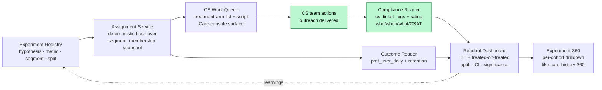

# stag_iceberg Scout → Enrichment + Closed-Loop Experimentation Map

**Date:** 2026-06-13 (GMT+7) · **Author:** scout synthesis · **Catalog:** `stag_iceberg` (Trino/Iceberg lakehouse)
**Method:** parallel introspection via `scripts/trino-query.mjs` (SHOW TABLES / DESCRIBE / count+max-date / 3-row samples). All timestamps below in **UTC** unless noted.

> TL;DR — `stag_iceberg` holds **115 schemas**. ~90 mirror per-game `game_integration` raws (low marginal value). The **real prize is ~6 cross-cutting data families** cube-playground does *not* model today: **monetization (payment/billing), acquisition (appsflyer/ad-cost), identity+behavior (vga/gds_da/thinking_data/sdk), CS (cs_ticket beyond what we use), curated BI marts (bi_\*), and system/lineage (metadata)**. The single linchpin for a closed experimentation loop is `billing.pmt_user_daily` — **live to yesterday** — which makes payment-outcome measurement actually possible. Recommended first E2E experiment: **lapsing high-LTV payer win-back**, run through the existing Segments + Care console.

---

## 1. Schema landscape (what's actually there)

115 schemas split into 6 buckets:

| Bucket | Schemas | New to cube-playground? | Value |
|---|---|---|---|
| Per-game raw mirrors | `cfm_vn`, `jus_vn`, `omg3`, `td`, `tlbb2`, … (~90) | Already modeled in `game_integration` | Low (redundant) |
| **Monetization** | `payment`, `payment_raw`, `billing`, `reward`(empty) | **Yes** | **High** |
| **Acquisition / marketing** | `appsflyer`, `mkt_ad_cost`, `marketing_cost`, `dlr_mkt`, `sdk` | **Yes** | **High** |
| **Identity + behavior** | `vga`, `gds_da`, `thinking_data` | **Yes** | **High** |
| **CS** | `cs_ticket` (16 tables; we use only `cs_ticket_new_master`) | Partial | Medium-High |
| **Curated BI marts** | `bi_cfm_vn`, `bi_td`, `bi_ttl`, `bi_ptg`, `bi_omg3_vn`, `bi_thiennu3`, `bi_ttlcy` | **Yes** | Medium |
| System / lineage | `metadata`, `iceberg_stag`, `information_schema` | **Yes** | Medium (ops) |
| Personal sandboxes | `khoitn`, `hoangnh11`, `linhdv2`, `phongpt6`, … | n/a | Ignore (incl. our own `khoitn` segment snapshot) |

---

## 2. Data shapes per family (the parts that matter)

### 2.1 Monetization — `billing` / `payment` / `payment_raw`
The most decision-relevant family. Three usable grains:

| Table | Schema | Grain | Rows | Freshness | Join key | Notes |
|---|---|---|---|---|---|---|
| **`pmt_user_daily`** | billing | user × product × day | ~35.5M | **2026-06-12 (LIVE)** | `user_id` | `npu`,`dpu`,`trans`,`rev_vnd`,`rev_usd`,`first_payment_date`,`bundle_code`. **The loop linchpin.** |
| `mf_payment_user_history` | billing | user × product (lifetime) | ~4.6M | 2026-01-13 (lags) | `user_id` | first/last pay date, lifetime `trans`, cumulative VND/USD → LTV tiers, recency. |
| `pmt_billing_ff_callback_trans` | payment | per order | ~904k | 2026-04-30 | `user_id`,`role_id`,`vga_id` | gross/net VND+USD, `payment_method_id`, `provider_name`, `country_code`. Deduped. |
| `etl_billing_ff_callback_trans_log` | payment_raw | per gateway callback | ~2.6M | 2026-05-17 | `user_id`,`vga_user_id` | `is_success`,`payment_status`,`payment_response_time` → **funnel + provider health**. Multi-row/order. |
| `std_payment_details` | billing | per order | ~36.7M | **2025-12-01 (STALE)** | `user_id` | archive snapshot; do not use for live. |

**Currency:** VND primary, USD derived from rate. **No refund/chargeback table found** (`reward` schema empty) — refunds likely live in `payment_status` enum of raw logs. **Identity caveat:** `user_id` format varies (numeric UUID vs game-account string); prefer `vga_id`/`vga_user_id` where populated.

### 2.2 Acquisition — `appsflyer` / `mkt_ad_cost` / `marketing_cost` / `dlr_mkt` / `sdk`
Closes the **spend → install → LTV** loop that today stops at in-game revenue.

| Table | Schema | Grain | Rows | Freshness | Role |
|---|---|---|---|---|---|
| `etl_appsflyer_installs` | appsflyer | per install (appsflyer_id) | 48.8M | 2026-01-05 | attribution source-of-truth: media_source, campaign, geo, device, `is_organic`. |
| `etl_appsflyer_inapp_events` | appsflyer | per event | **528M** | 2026-04-23 | post-install events incl. `event_revenue_usd`. |
| **`map_afid_uid`** | appsflyer | appsflyer_id × app | 152.7M | 2026-01-01 | **identity bridge** appsflyer_id↔uid (stale — verify coverage). |
| `campaign_daily` | mkt_ad_cost | day × bundle × source × campaign × ad | 2.1M | 2025-12-08 | unified cost/impr/clicks across FB/TikTok/Google/Apple. |
| `mkt_active_daily` | dlr_mkt | day × bundle × source × campaign | 207k | 2025-12-14 | **richest**: cost + installs + dau/mau + `recur_user_d2..d180` retention cohorts. |
| `etl_marketing_cost_apple_by_country` | marketing_cost | day × country × campaign × ad | 1.3M | **2026-06-07 (fresh)** | Apple Search Ads, `local_spend_currency`. |
| `mf_sdk_users` | sdk | game × user | — | — | game_id+user_id ↔ first_sdk_appsflyer_id (game-scoped identity bridge). |

**Key join risks:** `map_afid_uid` stale (5mo); `bundle_code ≠ game_id` (need canonical map); AF row-level cost is mostly NULL (use aggregated `campaign_daily`/`mkt_active_daily`); `recur_user_dN` retention definition unconfirmed.

### 2.3 Identity + behavior — `vga` / `gds_da` / `thinking_data`

| Table | Schema | Grain | Rows | Freshness | Role |
|---|---|---|---|---|---|
| `ingame_user_profile` | vga | game × user | 17.8M | 2mo stale | lifecycle truth-store: register, first/last login, first/last charge, last-active. |
| `mf_ip2location` | gds_da | game × user | 86.8M | **2026-05-18 (fresh)** | first/last IP geo → geo-stability, VPN/fraud, multi-country flags. |
| `{game}__events` | thinking_data | per event (58 cols) | cfm 198M / jus 17.8M | 2026-02-03 (4mo) | full behavioral stream: install→login→engagement→`ingame_prepaid`; device/geo/campaign context. |
| `{game}__user_profiles` | thinking_data | per user | jus 45.5k | 2026-03-05 | precomputed LTV (`total_revenue_vnd/usd`,`purchase_count`,`last_purchase_time`), VIP level, first/last campaign. |

**Identity is the recurring hazard:** vga `user_id` = social form (`gg.x`,`fb.y`); thinking_data primary key = `user_ingame_id` (game-scoped, `user_vga_id` often NULL); cs_ticket `user_id` needs `split_part(...,'@',1)`. **This is exactly the case for the existing cube member-resolver abstraction** — extend, don't hardcode.

### 2.4 CS — `cs_ticket` (16 tables; we use 1)
We model `cs_ticket_new_master`. Unused: `cs_ticket_info` (4.26M, ticket metadata + `vip_id`/`customer_id` + product/dept/pillar/service routing hierarchy, source=AIHelp/Facebook), plus 14 mapping/label tables. Enrichment: VIP-priority routing, support-volume-per-segment, post-ticket re-engagement/churn signal.

### 2.5 Curated BI marts — `bi_*` (per-game, NOT uniform)
Each game's `bi_*` is hand-curated, not a uniform product. `bi_cfm_vn` (21 tbl), `bi_ttl` (32 tbl incl. lookups), others minimal (1-4 tbl). Login/logout near-ubiquitous; recharge/economy game-specific. **Value = ready-made KPIs raw `game_integration` lacks:** `etl_ingame_reward_order_daily_mission_get` (mission completion, 2.7M), `etl_ingame_register` (signup cohort), `bi_td.etl_ingame_recharge` (promo-currency decomposition → ARPU-by-promo), `bi_ttl` item-economy/exchange/guild tables. **All ~30-day lag → historical/validation use, not live dashboards.** Grain mixing (events + snapshots + master) is a fan-out trap; model separately.

### 2.6 System — `metadata`
`etl_pg_audit` (DDL lineage), `kafka_offset`/`spark_offset` (ingestion lag), `s3_warm_object_metadata`. Powers a **data-freshness monitor** — directly useful given how much above lags.

---

## 3. Enrichment map (branch tree for prioritization)

Two value lenses for every branch: **(E) exploration** in the Playground/Catalog (model as Cube views, browse, chart) and **(C) consumer app** (Segments / member360 / Care console / Dashboards / Drift Center).

```mermaid
graph TD
  ROOT[stag_iceberg enrichment]

  ROOT --> MON[💰 Monetization<br/>billing/payment]
  ROOT --> ACQ[📣 Acquisition<br/>appsflyer/ad-cost]
  ROOT --> IDB[🧬 Identity+Behavior<br/>vga/gds_da/thinking_data]
  ROOT --> CS[🎧 CS depth<br/>cs_ticket x16]
  ROOT --> BI[📊 BI marts<br/>bi_*]
  ROOT --> SYS[🩺 Freshness/lineage<br/>metadata]

  MON --> M1[E: revenue/ARPU/LTV views<br/>product×country×method×day]
  MON --> M2[C: payer LTV tiers + recency<br/>→ segment dims + member360]
  MON --> M3[C: 🔁 EXPERIMENT OUTCOME ENGINE<br/>pmt_user_daily live re-pay measurement]
  MON --> M4[E: payment funnel + provider health<br/>is_success/latency]

  ACQ --> A1[E: CAC by channel/campaign/day]
  ACQ --> A2[C: channel→LTV + install→pay funnel<br/>payback cohorts]
  ACQ --> A3[C: organic vs paid retention<br/>acquisition-source segment dim]

  IDB --> I1[C: member360 unification<br/>vga + geo + LTV + CS]
  IDB --> I2[C: churn early-warning<br/>last-active gap → Care queue]
  IDB --> I3[E: behavioral cohorts<br/>thinking_data event funnels]
  IDB --> I4[X: extend member-resolver<br/>vga↔ingame↔cs identity]

  CS --> C1[C: VIP-priority routing<br/>vip_id + product/dept hierarchy]
  CS --> C2[C: support→retention impact signal]

  BI --> B1[E: model unmodeled KPIs<br/>missions/register/item-economy]
  BI --> B2[E: promo-aware ARPU<br/>bi_td recharge decomposition]

  SYS --> S1[C: data-freshness monitor<br/>kafka_offset → Drift Center panel]

  classDef hot fill:#fde68a,stroke:#b45309,color:#111;
  class M3,M2,A2,I2,I1 hot
```

**Prioritization (impact × feasibility × freshness):**

| Rank | Branch | Why now | Freshness gate |
|---|---|---|---|
| **P0** | `M3` Experiment outcome engine + `M2` payer LTV/recency dims | Unlocks the closed loop; reuses Segments+Care already shipped | `pmt_user_daily` LIVE ✅ |
| **P1** | `I1` member360 unification + `I2` churn early-warning | Highest user-visible payoff; feeds Care queue | gds_da geo fresh ✅; vga/thinking_data lag ⚠️ |
| **P1** | `C1` CS VIP routing | Small lift on data we already touch | cs_ticket 3mo ⚠️ (ok for triage) |
| **P2** | `A2` channel→LTV / install→pay funnel | Strategic (UA ROI) but identity+cost joins are fragile | ad-cost lags, `map_afid_uid` stale ⚠️ |
| **P2** | `B1/B2` BI-mart KPIs (missions, promo-ARPU) | Cheap exploration wins; pure Cube modeling | 30-day lag → historical only |
| **P3** | `S1` freshness monitor | Operational hygiene; protects everything above | metadata live |

> **Freshness is the governing constraint of this lakehouse.** Only `pmt_user_daily`, `mf_ip2location`, and Apple-cost are current; most else lags 1–6 months. Design live features on the fresh trio; treat the rest as historical/exploratory.

---

## 4. The closed experimentation loop (the second ask)

You lean toward **picking one experiment and running it end-to-end first** — agreed, that's the right call. Below is (a) the one experiment to ship now, and (b) the complete platform it generalizes into (the "CS-data-style" feature family).

### 4.1 The actuation model: CS team is the treatment arm (no direct player push)
We have **no ability to push messages/offers to players directly**. So the treatment is **delivered by the customer-support team** acting on a target list we hand them — and crucially, **CS actions sync back into `cs_ticket`**, so treatment delivery is itself *observable data*, not an assumption. The closed loop therefore has **two measured edges**, not one:

- **Outcome edge** — `billing.pmt_user_daily` (the only monetization table current to *yesterday*; keyed by `user_id`; `rev_vnd`/`trans`/`npu` per day) gives re-pay/uplift T+1.
- **Compliance edge** — `cs_ticket.cs_ticket_logs` records every CS action with `action_code`/`action_name`, `status_before→status_after`, staff (`by_id`/`created_by`), and `log_time`; `cs_rating_processes` adds CSAT `rating` + handling time. So we can tell **who was actually contacted, when, by whom, what action, and how it went** — and match it back to the assigned cohort.

This is strictly *better* than a direct-push design: human delivery is imperfect (CS capacity, reachability), and because we observe delivery we can run an honest **intention-to-treat vs treatment-on-treated** analysis instead of pretending 100% of the treatment arm got touched.

### 4.2 First experiment to run end-to-end (POC)
**"Lapsing high-LTV payer win-back, delivered by CS."**

- **Hypothesis:** CS proactive outreach to high-lifetime-value payers who have lapsed (no purchase in 21–60 days) lifts 14-day re-pay rate vs. no-touch control.
- **Population:** from `mf_payment_user_history` — lifetime VND in top quartile AND `last_payment_date` 21–60 days ago. Scope to one game with live data (e.g. `cfm_vn` or `jus_vn`).
- **Assignment:** deterministic 50/50 hash split over the nightly segment-membership snapshot (already written to `stag_iceberg.khoitn`). Persist assignment so it's stable across the window.
- **Treatment (CS-actuated):** software produces a **CS work queue** — the treatment-arm member list + outreach script/instructions, surfaced in a Care/CS-facing view (extends the Care console we already shipped). CS works the queue.
- **Compliance (synced back):** match `cs_ticket_info.user_id` (`split_part(...,'@',1)`) + `cs_ticket_logs` action trail to the assigned cohort within the window → flag *actually-contacted* members; capture action type + CSAT.
- **Outcome:** from `pmt_user_daily`, `rev_vnd` + `trans` in 14 days post-assignment, per arm.
- **Analysis:** **ITT** (assigned-treatment vs control) as primary; **treatment-on-treated** (contacted vs control, compliance-adjusted) as secondary; CSAT as a treatment-quality covariate.
- **Loop closes & "plan to adjust":** outcome + compliance both readable T+1 → tune cohort thresholds, outreach script, and CS targeting each round.

Reuses four things already in the repo: **Segments** (cohort), **Care console** (CS-facing treatment queue), **CS data connection** (compliance sync-back — already built), **lakehouse snapshot writer** (assignment log). True E2E in one slice; the only genuinely new piece is the experiment registry + readout.

### 4.3 The generalized platform (paired feature set, mirrors the CS→Care pattern)
Once the slice works, the same shape generalizes (exactly how cs_ticket → Care tab / care-history-360 grew):

Feature inventory (each = a small consumer surface, like the Care work):
1. **Experiment Registry** (server route + SQLite table): hypothesis, target segment id, primary metric, arms, dates.
2. **Assignment service**: deterministic split over membership snapshot; immutable assignment log in `stag_iceberg.khoitn` (reuse `segment-snapshot-writer` pattern).
3. **CS Work Queue** (React, extends Care console): treatment-arm member list + outreach script, exportable/workable by CS. This is the treatment-delivery surface — CS-facing, not player-facing.
4. **Compliance reader** (`server/src/lakehouse/`): joins `cs_ticket_logs`/`cs_ticket_info`/`cs_rating_processes` back to the assigned cohort → contacted-flag, action type, CSAT, handling time. New reader alongside `cs-ticket-detail-reader.ts`.
5. **Outcome reader** (`server/src/lakehouse/`): reads `pmt_user_daily` (+ optionally login/retention) windowed by assignment date, per arm.
6. **Readout dashboard** (React, `src/pages/`): ITT + treated-on-treated uplift cards, cumulative re-pay time-series by arm, significance/CI — existing design tokens + recharts.
7. **Experiment-360** drilldown: per-cohort member list with LTV/recency + CS contact history (reuse member360 + new monetization/identity dims).

### 4.4 PII & reachability — do we have Zalo/phone to wire in? (scouted 2026-06-14)
Question: to let CS cold-call / Zalo a target list, does the data give us per-user contact PII?

**Finding — per-user raw contact PII is essentially NOT in the analytics surface:**
- **VGA PII (canonical store) is exposed only as AGGREGATE coverage.** Both MCP resolvers (`vga_pii_by_game`, `vga_pii_all_game`) and `linhdv2.vga_pii_daily_snapshot` (856k rows, fresh to 2026-06-13) return **counts** — `total_users`, `have_phone`, `verified_phone`, `have_email`, `phone_or_email` — grouped by cohort (game/revenue-tier/gender/age/territory/activity). You can learn *"78% of this cohort is phone-verified"* but **not** *"user X's number"*. Privacy-by-design.
- **No `zalo_id` field anywhere.** In VN, Zalo is keyed by phone number → `msisdn` *is* the Zalo handle.
- **Only bulk per-user phone found = payment-rail logs.** `payment_raw.etl_billing_ff_zmp_translog` (ZaloPay): **2.0M rows, 100% `msisdn` populated**; `etl_sea_gateway_trans_log`: `customer_msisdn` + `customer_email`. Real phone — but **payment-scoped** (only users who paid via that rail) and it's **payment PII** (legal/privacy sign-off required to repurpose for outreach).

**Architectural recommendation: keep raw PII OUT of our product.**
- Our product hands CS a **target list keyed by game `user_id`** + reachability metadata. CS resolves the actual phone/Zalo in **their own authorized CRM/ticketing tooling** (they already hold it — they're the support team) and reaches out there. The action syncs back via `cs_ticket_logs`. We never store/display raw contact PII → smallest compliance surface.
- Use **aggregate coverage** (`vga_pii_*`, fresh) at design time to size the arm: *"cohort is 78% phone-verified → ~78% contactable"* sets a realistic treatment ceiling and powers an honest treatment-on-treated denominator.
- If we ever must show CS a number *inline*, that's a **separate governed PII-resolution integration** (access-controlled + audited), not a lakehouse read. Don't scope it into the POC.

### 4.5 Statsig as a reference — what to borrow, what to adapt
Borrow the **product layer** concepts; adapt the **delivery model** (Statsig assumes you control delivery via SDK and auto-log exposures — we don't; CS is a human channel).

| Statsig concept | Borrow as-is | Our adaptation |
|---|---|---|
| Experiment/feature registry | ✅ | Registry over a Segment (cohort = our "targeting gate"). |
| **Exposure logging** | concept ✅ | Exposure = **`cs_ticket_logs` action** (proof CS delivered) — not an SDK event. |
| Assignment / bucketing | ✅ | Deterministic hash split over the **segment-membership snapshot**. |
| Holdout / control group | ✅ | The untouched arm; this is the "compare vs holdout" surface the user wants. |
| Scorecard (lift, CI, p-value) | ✅ | On `pmt_user_daily` outcomes; ITT + treatment-on-treated. |
| Guardrail metrics, CUPED, sequential testing | ✅ later | Add once the basic scorecard works. |

The two treatment-path types you named map cleanly onto the same engine:
- **(a) Promo campaign sent per user** → exposure = open/activation tracking. *We do not have an open/activation feed yet* — would need a campaign-delivery tracking source. Defer.
- **(b) CS cold reach-out** → exposure = `cs_ticket_logs`. **Already syncs → start here.** Same registry/assignment/scorecard; only the exposure reader differs. The product is built path-agnostic so (a) plugs in later.

### 4.6 Other hypotheses the data can seed (backlog, not now)
- **Promo-type efficiency** (bi_td recharge decomposition): does first-recharge bonus vs extra-coin bonus change D30 LTV?
- **Channel quality** (appsflyer + pmt): does paid-FB cohort re-pay worse than organic at equal D0 spend?
- **Geo-stability churn** (gds_da first_ip≠last_ip): does a location-shift flag predict lapse, and does a security-nudge reduce it?
- **CS-resolution → retention** (cs_ticket + pmt): does fast VIP ticket resolution lift subsequent re-pay?

---

## 5. Cross-cutting risks (apply to all branches)
1. **Identity normalization is mandatory** — 3+ id namespaces (vga social, thinking_data ingame, cs split_part, payment vga_id/user_id). Route everything through the member-resolver; do not hardcode per-table joins.
2. **Freshness tiering** — live (pmt_user_daily, mf_ip2location, Apple-cost) vs lagging (vga 2mo, thinking_data 4mo, ad-cost 6mo) vs stale-archive (std_payment_details). Live features only on live tables.
3. **Fan-out** — user-grain dims (LTV, geo) join cleanly; event/transaction tables (thinking_data 528M, callback logs) fan out — pre-aggregate or model at separate grain.
4. **No refund table** — monetization "net" needs the refund source confirmed before any revenue-truth claim.
5. **PII** — thinking_data/appsflyer carry device ids, IPs; keep Iceberg backend-only, redact in any UI/Cube export.
6. **Scan cost** — thinking_data + appsflyer_inapp_events are 100M–500M rows; require date-partition pruning / CubeStore pre-aggs before exposing.

---

## 6. Recommended next step
Ship section **4.2** as a one-week E2E slice (Registry → Assignment → Outcome reader → minimal Readout), scoped to a single game, riding Segments + Care console. Prove the loop on real `pmt_user_daily` outcomes before generalizing to the section-4.3 platform. In parallel (cheap, independent): model **payer LTV/recency dims** (M2) and the **freshness monitor** (S1).

---

## Unresolved questions
1. **Refund/chargeback source** — where? (blocks any "net revenue" / true-uplift claim).
2. **Canonical `bundle_code` ↔ `game_id` map** — exists as a table, or must be inferred? (gates all acquisition joins).
3. **`map_afid_uid` real coverage** for 2025-12+ installs (stale to 2026-01-01) — full snapshot or partial?
4. **vga 2-month staleness** — sync throttle or broken pipeline? (affects identity truth-store reliability).
5. **`recur_user_dN` definition** in dlr_mkt — cohort-% retention or absolute active count?
6. **`thinking_data.user_vga_id` NULL rate** — is `user_ingame_id`+`game_id` the only reliable behavioral key?
7. **Treatment delivery** — RESOLVED: no direct player push; CS team is the actuator and their actions sync back via `cs_ticket_logs`/`cs_rating_processes` (action, status, staff, CSAT, timing). Open sub-question below.
8. **Does proactive/outbound CS outreach create a logged ticket?** — `cs_ticket` sources seen so far are inbound (AIHelp/Facebook). Compliance tracking only works if CS logs the win-back outreach as a ticket/action. Confirm the CS workflow captures outbound campaigns, else compliance edge is blind. (Operational/process question, not answerable from data alone.)
9. **CS capacity & cohort size** — how many outreach contacts/day can CS absorb? Caps treatment-arm size and experiment duration to reach significance.
9b. **Contact PII** — RESOLVED (2026-06-14): analytics surface exposes phone/email only as *aggregate coverage* (vga_pii_*), not per-user; only bulk per-user phone is ZaloPay `msisdn` (payment-scoped, PII-sensitive). Recommendation: product holds no raw PII; CS resolves contact in own tooling. Open: does CS tooling actually have current Zalo/phone for *lapsed* payers, or only for those who filed tickets?
10. **`pmt_user_daily.npu`/`dpu` exact semantics** — needed before using as an experiment metric.
